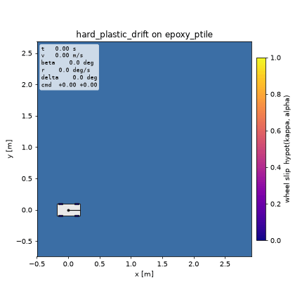
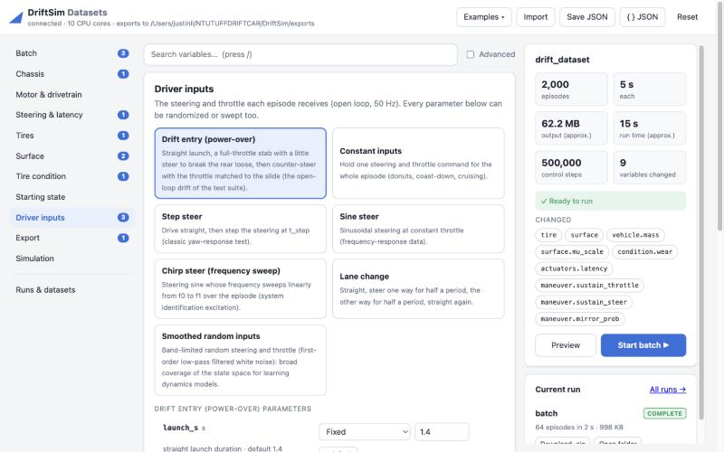
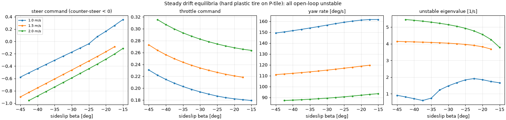
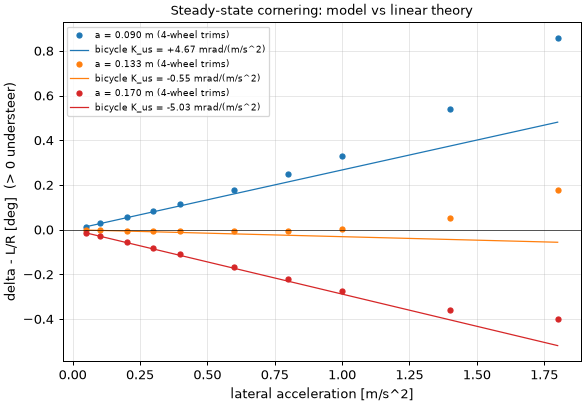
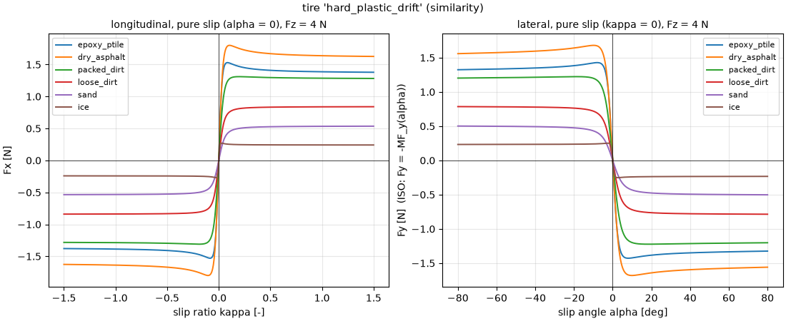

# DriftSim

A fast, vectorized simulator of a 1/10-scale RC drift car, built to train a reinforcement-learning
policy that drifts on many surfaces and tire conditions and then runs on a real car.

<p align="center">
  
  <br><em>The simulated car launches, kicks the rear out with a throttle stab, and a feedback
  controller holds it in a steady 30° drift.</em>
</p>

## What it does

- **Four-wheel car model.** Planar dynamics with load transfer, a brushless motor and ESC,
  battery sag, selectable drivetrain (rear-wheel drive, AWD spool, AWD with front overdrive),
  open / locked / limited-slip differentials, a rate-limited steering servo, control latency and an
  optional steering gyro.
- **Realistic tires.** Pacejka Magic Formula with combined slip, relaxation length and a low-speed
  model, plus tire temperature, wear, wetness and dust that change the grip as you drive.
- **Many surfaces.** 4 tire compounds x 11 surfaces (asphalt, P-tile, carpet, dirt, gravel, sand,
  ice, ...). Loose ground has no sharp grip peak and adds plowing drag instead of just lower grip.
- **Batches of different cars.** Thousands of cars, each with its own mass, tires, surface, wear,
  latency and so on, step together in one vectorized batch.
- **Dataset export.** Describe what to vary in a JSON spec and get NPZ / CSV / Parquet files with a
  manifest and a per-episode summary, generated in parallel on all CPU cores.
- **Reinforcement learning.** Gymnasium environments for holding a drift and for drifting round a
  circle: thousands of cars in one vectorized simulation (CPU or GPU), sensor-like observations
  with noise, per-episode domain randomization in the batch-spec language, a model-based reference
  controller and a compact PPO trainer.
- **GPU acceleration.** Generate data on an Apple Silicon (MPS) or NVIDIA (CUDA) GPU with PyTorch;
  the NumPy CPU path stays the bit-reproducible float64 reference.
- **Web GUI.** Change any variable, preview a few episodes, run large batches in the background and
  download the results, all from a local page in your browser.
- **Analysis tools.** Steady-state (trim) solver, stability analysis, an LQR drift controller,
  a top-down renderer and time-series plots.
- **Checked against physics.** Over 100 tests, including understeer against textbook theory and exact
  agreement between batched and single-car runs.

## Status

| milestone | status |
|---|---|
| 1. Physics model, visualizer, tests | **done** |
| Batch data generation (command line and Python) | **done** |
| Web GUI for batch export | **done** |
| 2. Surface maps and roughness (tire-condition model already done) | next |
| 3. GPU acceleration (PyTorch on Apple MPS / NVIDIA CUDA) for data generation | **done** (RL env on GPU comes with M4) |
| 4. Gymnasium environment and drift rewards | **done** ([docs/RL.md](docs/RL.md)) |
| 5. PPO training, first learned drift | next (a working PPO trainer is included) |
| 6. Domain randomization, realistic sensors, curriculum | planned (per-car batching is in place) |
| 7. Mixed-surface tasks and evaluation suite | planned |
| 8. System identification from real-car logs, ONNX export | planned |

## Install

Python 3.11 is recommended.

```bash
git clone https://github.com/CYLI310/DriftSim.git
cd DriftSim
python3.11 -m venv .venv
source .venv/bin/activate
pip install -e ".[dev]"
pip install -e ".[gpu]"     # optional: PyTorch for GPU-accelerated data generation (Apple MPS / NVIDIA CUDA)
```

## Quick start

```python
from rc_drift_sim import make_vehicle
from rc_drift_sim.control.maneuvers import open_loop_drift_actions

car = make_vehicle("hard_plastic_drift", "epoxy_ptile")       # tire compound, surface
actions = open_loop_drift_actions(car.params, duration=4.0)   # (T, 2): steer, throttle in [-1, 1] at 50 Hz
traj = car.rollout(car.initial_state(), actions)

print(traj.speed.max(), traj.beta.min())                      # m/s, sideslip in rad

heavier = make_vehicle("hard_plastic_drift", "epoxy_ptile", mass=1.9, latency=0.04)  # change any variable
```

Run `python examples/quickstart.py` for the full version: it also simulates several different cars
in one batch and saves a plot and an animation.

## Web GUI

```bash
driftsim-gui
```

This opens `http://127.0.0.1:8765` in your browser (only your computer can connect).

<p align="center">
  
</p>

- **Change variables easily.** Every variable is listed with its unit and a plain description. Set
  any of them to fixed, random (uniform, normal, log-uniform, pick from a list) or a sweep grid.
  "× default" scales each tire's or surface's own value, and tire condition can differ per wheel.
  Press `/` to search all 119 variables.
- **See what you will get.** The summary checks the spec as you type and estimates size and run
  time. Preview simulates a few episodes and plots their paths, speed, sideslip and inputs.
- **Run and download.** Start runs in the background with progress and cancel (further runs
  queue). Datasets appear under Runs & datasets, where you can download a zip or single files, open
  the folder, or load an old dataset's spec to tweak and rerun.
- **Same files as the command line.** Save JSON writes a spec that `driftsim-datagen` runs as is,
  and the Examples menu loads the specs in `examples/specs/`.

Options: `--port`, `--out` (export folder), `--no-browser`.

**Start it without a terminal (macOS).** Build the launcher app once:

```bash
scripts/mac/make_app.sh
```

Then double-click `DriftSim.app` (in the repository folder; you can drag it to the Dock or
Applications). It starts the server in the background and opens the page. Double-click it again
to open the page or stop the server. Alternatively, double-click `scripts/mac/Start DriftSim.command`
to run the server in a Terminal window; closing the window stops it.

From a shell, `scripts/driftsim-gui.sh` does the same: `--background`, `--stop`, `--status`.
Background logs go to `~/Library/Logs/DriftSim/server.log`. Stopping cancels a run in progress
and keeps the files already written.

**Windows.** `DriftSim.exe` is a self-contained build of the GUI (no Python needed): run it, the page
opens in the browser, datasets go to `Documents\DriftSim\exports`, and closing its window stops it.
Get it from the "Windows" GitHub Actions workflow (Actions tab, Run workflow, then the
`DriftSim-windows-x64` artifact), or build it on a Windows PC with Python 3.11:

```powershell
powershell -ExecutionPolicy Bypass -File scripts\windows\build_exe.ps1            # dist\DriftSim\DriftSim.exe
powershell -ExecutionPolicy Bypass -File scripts\windows\build_exe.ps1 -WithTorch # with PyTorch for GPUs
```

To run from the source checkout instead, double-click `scripts\windows\Start DriftSim.bat`.

## Reinforcement learning

```python
import gymnasium as gym
import rc_drift_sim.rl as rl

env = gym.make("DriftSim/DriftHold-v0")                                  # one car
envs = rl.DriftVectorEnv(1024, rl.EnvConfig(task="track", randomize={...}))   # 1024 cars at once
```

```bash
driftsim-train --task hold --envs 1024 --steps 20000000 --out runs/hold        # PPO
```

Tasks, observations, rewards, randomization and reference scores: [docs/RL.md](docs/RL.md).

## Generate datasets from the command line

```bash
driftsim-datagen examples/specs/domain_randomization.json
```

A spec says which variables to fix, randomize or sweep, which driver inputs to use and what to
export:

```json
{
  "name": "my_dataset", "episodes": 1000, "duration_s": 4.0,
  "params": {
    "tire":             {"dist": "choice", "values": ["hard_plastic_drift", "rubber_onroad"]},
    "vehicle.mass":     {"dist": "uniform", "low": 1.4, "high": 1.8},
    "condition.wear":   {"dist": "uniform", "low": 0.0, "high": 0.6, "per_wheel": true},
    "actuators.latency": {"dist": "choice", "values": [0.02, 0.04]}
  },
  "maneuver": {"type": "random"},
  "export":   {"formats": ["npz", "csv"]}
}
```

On a laptop (Apple M4) this runs at 150 to 250 four-second episodes per second. The data is
reproducible from the spec alone. See [docs/DATA_GENERATION.md](docs/DATA_GENERATION.md) for the
full guide and [docs/PARAMETERS.md](docs/PARAMETERS.md) for every variable you can set.

## Results

Milestone 1 validation, regenerated by `python scripts/make_figures.py`:

| check | result |
|---|---|
| Understeer gradient vs linear theory, front-heavy car | 4.36 vs 4.67 mrad/(m/s²) |
| Understeer gradient vs linear theory, rear-heavy car | −4.94 vs −5.03 mrad/(m/s²) |
| Coasting deceleration vs analytic prediction | within 1.3 % |
| RK4 at 1 kHz vs 4x smaller step | converged to under 0.04 cm |
| Drift equilibrium at 1.5 m/s, 30° sideslip | exists, one unstable mode (+4.0 /s), held by the LQR |
| Batched cars vs the same cars simulated alone | bit-identical |

<p align="center">
  <br>
  <em>Steady drift equilibria: counter-steer and throttle needed at each sideslip, and how fast each
  one diverges without feedback.</em>
</p>

<p align="center">
  
  <br>
  <em>Left: steady-state cornering matches linear theory at low lateral acceleration. Right: the drift
  tire on paved surfaces peaks sharply; on loose ground grip keeps building.</em>
</p>

## Project layout

```
DriftSim/
├── rc_drift_sim/          the Python package
│   ├── configs/           vehicle.yaml, tires.yaml, surfaces.yaml: every default value
│   ├── sim/               physics: vehicle, tire, surface, drivetrain, actuators, integrator,
│   │                      trim / stability analysis, parameter and state definitions
│   ├── control/           open-loop maneuvers and the LQR drift controller
│   ├── datagen/           batch dataset generation (driftsim-datagen)
│   ├── app/               web GUI (driftsim-gui): local server and the page in static/
│   ├── rl/                Gymnasium environments, rewards, reference controllers, PPO (driftsim-train)
│   └── viz/               top-down renderer, animations, time-series plots
├── examples/              quickstart.py, batch_export.py, specs/*.json ready-made datasets
├── scripts/               driftsim-gui.sh (start / stop the GUI), mac/ (DriftSim.app launcher),
│                          windows/ (DriftSim.exe build, Start DriftSim.bat), bench_devices.py,
│                          make_figures.py, tune_drift.py, make_param_reference.py
├── tests/                 pytest suite
└── docs/
    ├── DATA_GENERATION.md how to make datasets
    ├── RL.md              the reinforcement-learning environments and trainer
    ├── PARAMETERS.md      every variable with default, unit and description (generated)
    ├── DESIGN.md          the physics model: conventions, equations, module contracts, findings
    └── images/            figures used here
```

## Tests

```bash
pytest                                        # about 80 s
pytest -s -m benchmark                        # throughput numbers
python scripts/make_param_reference.py --check
```

## Good to know

- **Conventions.** SI units inside the code (angles in degrees only in configs and specs, under
  `*_deg` names). Wheel order is always front-left, front-right, rear-left, rear-right. Sideslip is
  negative in a left-hand drift.
- **Drifting is unstable without feedback.** A rear-wheel-drive drift is an unstable equilibrium,
  as in real cars, so the open-loop drift in the tests is sensitive to physics changes. After
  changing the model, re-tune it with `python scripts/tune_drift.py`.
- **Time steps.** Physics runs at 1 kHz with RK4 and control at 50 Hz. The model warns if a
  configuration is too stiff for the chosen step.

## Documentation

- [docs/DATA_GENERATION.md](docs/DATA_GENERATION.md): generating datasets
- [docs/RL.md](docs/RL.md): reinforcement-learning environments, rewards and the PPO trainer
- [docs/PARAMETERS.md](docs/PARAMETERS.md): every variable, maneuver and exportable signal
- [docs/DESIGN.md](docs/DESIGN.md): the physics model in depth
